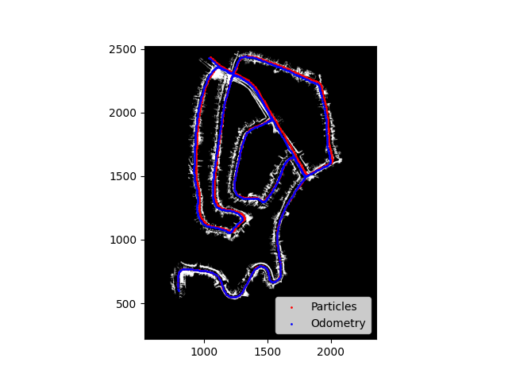
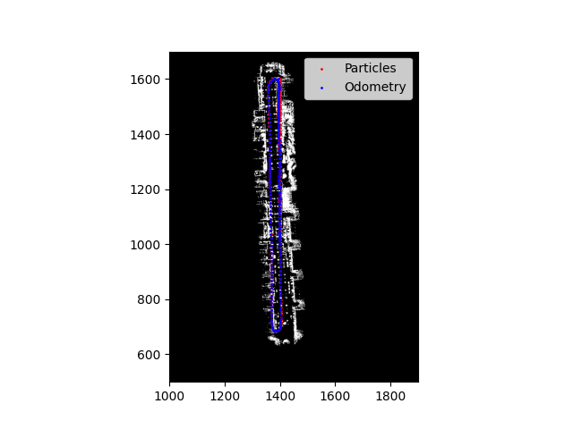
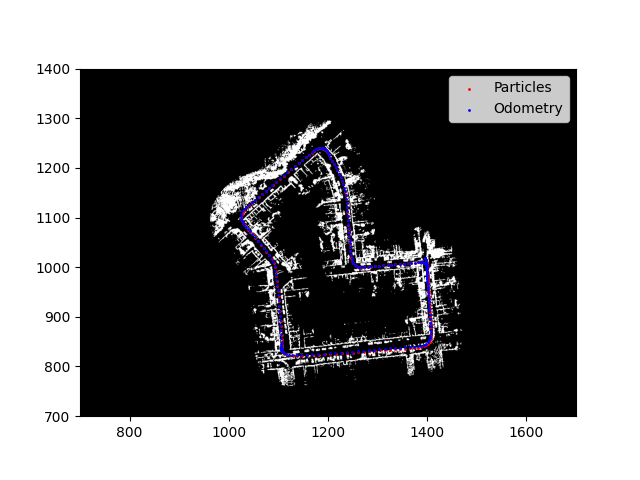
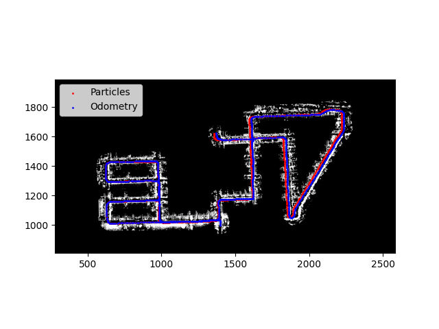

# KITTI LiDAR Particle Filter SLAM (ESE 6500 Coursework)

This repository implements a particle filter-based SLAM (Simultaneous Localization and Mapping) system for the KITTI dataset, as part of the coursework for **ESE 6500: Learning in Robotics** at the University of Pennsylvania. The provided codebase includes a combination of skeleton code (provided by the course staff) and my own implementations in designated `TODO` areas.

## Project Structure

| File         | Description                                                                                  | Author(s)                  |
|--------------|---------------------------------------------------------------------------------------------|----------------------------|
| `main.py`    | Main entry point for running dynamics, observation, or full SLAM pipeline.                  | Skeleton: Course staff     |
| `slam.py`    | Core SLAM logic. **I implemented only the code in `TODO` areas.**                           | Skeleton: Course staff, Me |
| `utils.py`   | Utility functions for coordinate transforms, point cloud cleaning, etc.                      | Course staff               |
| `load_data.py`| Data loaders and visualization for KITTI dataset.                                           | Course staff               |

**Note:**  
I did **not** write any code in `utils.py` or `load_data.py`. My work is limited to the `TODO` sections in `slam.py` and integrating those changes via `main.py` as required by the coursework.

## File Descriptions

- **main.py**
  - CLI interface for running different modes (dynamics, observation, slam).
  - Handles plotting and logging.
  - *Skeleton code provided by course staff.*

- **slam.py**
  - Defines `slam_t` and `map_t` classes.
  - Implements particle filter steps: initialization, prediction (dynamics), update (observation), and resampling.
  - **My code is only in the `TODO` blocks; all other code was provided.**

- **utils.py**
  - Coordinate transformations, pose math, and point cloud filtering.
  - *Entirely provided by course staff; I did not modify or contribute to this file.*

- **load_data.py**
  - Loading and visualizing KITTI LiDAR and pose data.
  - *Entirely provided by course staff; I did not modify or contribute to this file.*

---

## Figures

